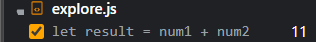
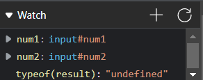
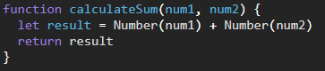

1. The function was treating the inputs as strings, and thus the output was the result of concatenating the two strings.
2. I would fix it by converting each variable to a number using Number().

